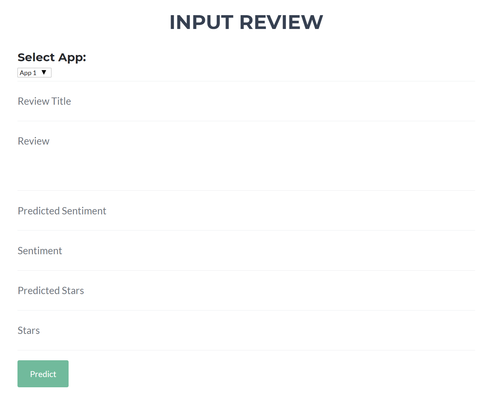
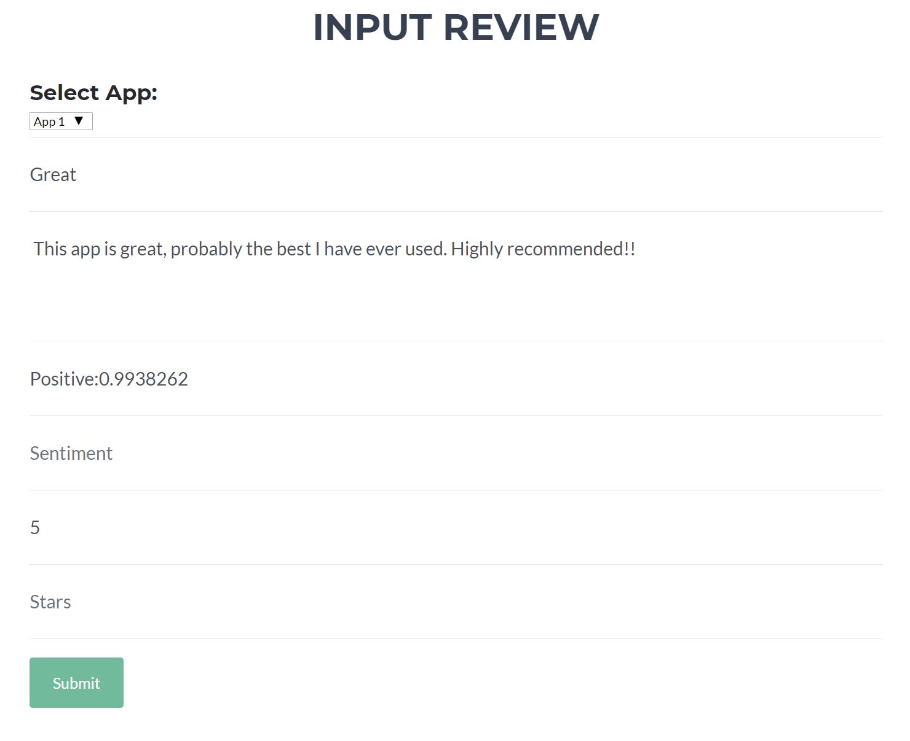
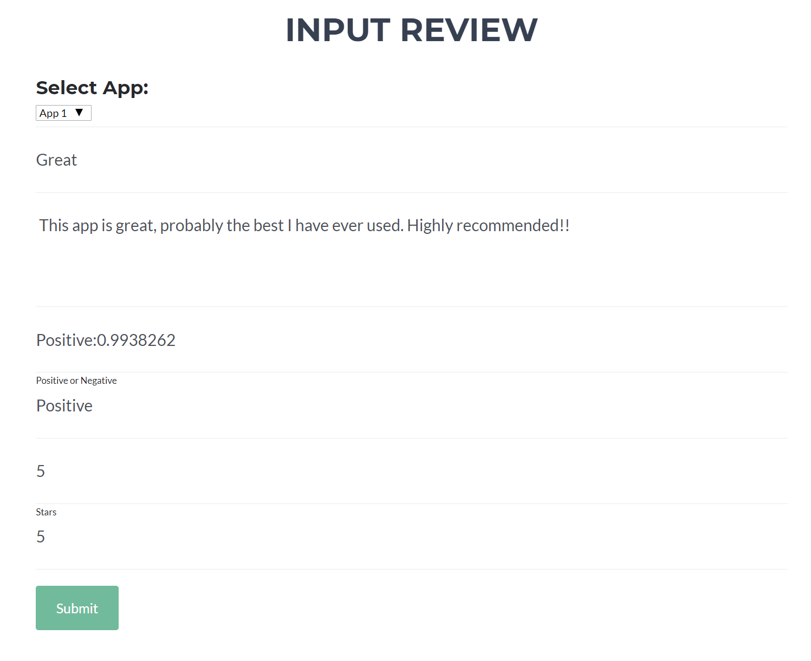

# app_rating_predictions
Predicting app star ratings from reviews left in the app store.

Project presents a basic end to end data science project, including; a flask web application which has a web form to allow user reviews to be submitted and uses two models which are deployed in sperate API's (microservices) to dynamically predict stars and the sentiment of the review (whether a review is positive or negative).

The web application has a basic web form:

The form gets filled out by the user, the predict button is pressed and the information is sent to the model services which then returns their predicitions:

The form is then completed by the user and submitted into a database (local sqlite db).

Storing this information allows for back testing, monitoring model performance an re-training.

The web application is built using flask, along with one of the api's, the other is built with quart.

